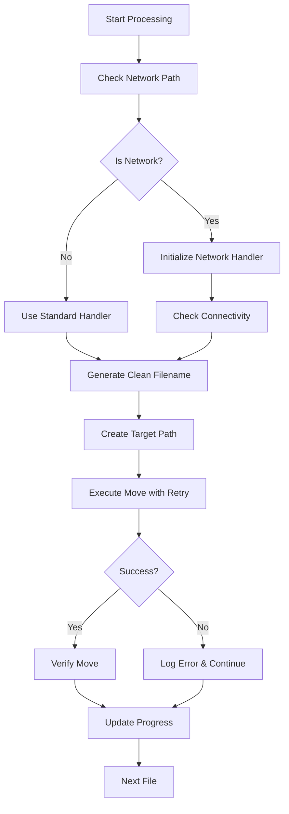
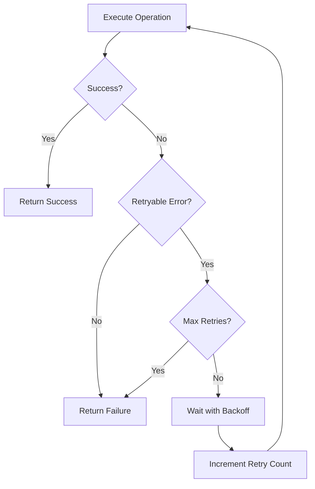

# Design Document

## Overview

Este design resolve o problema crítico onde o Movie Organizer falha ao processar arquivos em localizações de rede devido à ausência da função `organize_movie_file` no serviço `FileMover`. A solução implementa a função ausente, adiciona robustez para operações de rede e melhora o tratamento de erros.

## Architecture

### Current Architecture Issues
- `MovieOrganizerGUI.process_files()` chama `FileMover.organize_movie_file()` que não existe
- Falta de tratamento específico para operações em rede
- Falhas individuais causam encerramento abrupto da aplicação
- Ausência de retry logic para operações de rede

### Proposed Architecture
- Implementar `FileMover.organize_movie_file()` como função principal de organização
- Adicionar `NetworkFileHandler` para operações específicas de rede
- Implementar padrão de retry com backoff exponencial
- Melhorar isolamento de erros para processamento contínuo

## Components and Interfaces

### 1. FileMover Enhancement

#### New Method: `organize_movie_file()`
```python
def organize_movie_file(self, source_path: Path, metadata: MovieMetadata, target_folder: Path, file_pattern: str = None) -> Tuple[bool, str, Optional[Path]]:
    """
    Rename and move movie file to organized location
    
    Args:
        source_path: Original file path
        metadata: Movie metadata for naming
        target_folder: Destination folder
        file_pattern: Optional naming pattern (default: "{title} ({year}){extension}")
    
    Returns:
        Tuple[bool, str, Optional[Path]]: (success, message, final_path)
    """
```

#### Enhanced Constructor
```python
def __init__(self, file_pattern: str = "{title} ({year}){extension}"):
    """Initialize FileMover with configurable file naming pattern"""
```

### 2. NetworkFileHandler (New Component)

```python
class NetworkFileHandler:
    """Handles network-specific file operations with retry logic"""
    
    def __init__(self, max_retries: int = 3, base_delay: float = 1.0):
        self.max_retries = max_retries
        self.base_delay = base_delay
    
    def is_network_path(self, path: Path) -> bool:
        """Check if path is on network location"""
    
    def execute_with_retry(self, operation: Callable, *args, **kwargs) -> Any:
        """Execute operation with exponential backoff retry"""
    
    def check_network_connectivity(self, path: Path) -> bool:
        """Verify network path is accessible"""
```

### 3. Enhanced Error Handling

#### ProcessingContext Class
```python
@dataclass
class ProcessingContext:
    """Context for tracking processing state"""
    total_files: int
    processed_files: int
    successful_moves: int
    failed_moves: int
    current_file: Optional[str] = None
    errors: List[str] = field(default_factory=list)
    
    def add_success(self, filename: str, message: str):
        """Record successful operation"""
    
    def add_failure(self, filename: str, error: str):
        """Record failed operation"""
```

## Data Models

### Enhanced MovieMetadata

Add method for generating clean filenames:
```python
def get_clean_filename(self, pattern: str = "{title} ({year}){extension}", extension: str = "") -> str:
    """Generate clean filename based on pattern and metadata"""
```

### Network Operation Result

```python
@dataclass
class NetworkOperationResult:
    """Result of network file operation"""
    success: bool
    message: str
    retry_count: int
    final_path: Optional[Path] = None
    error_type: Optional[str] = None  # 'permission', 'network', 'space', 'other'
```

## Error Handling

### Error Categories
1. **Network Connectivity**: Connection lost, timeout, unreachable
2. **Permission Errors**: Access denied, insufficient privileges
3. **File System Errors**: Disk full, path too long, invalid characters
4. **File Conflicts**: Duplicate names, locked files

### Error Recovery Strategies
1. **Retry with Backoff**: For transient network issues
2. **Alternative Naming**: For file conflicts
3. **Skip and Continue**: For individual file failures
4. **Graceful Degradation**: Fallback to basic operations

### Retry Logic Implementation
```python
def retry_with_backoff(operation, max_retries=3, base_delay=1.0):
    """
    Exponential backoff: 1s, 2s, 4s delays
    Network-specific errors trigger retry
    Permission errors fail immediately
    """
```

## Testing Strategy

### Unit Tests
- `test_organize_movie_file()`: Test core functionality
- `test_network_path_detection()`: Test network path identification
- `test_retry_logic()`: Test exponential backoff
- `test_error_handling()`: Test various error scenarios

### Integration Tests
- `test_network_location_processing()`: End-to-end network processing
- `test_mixed_local_network_files()`: Mixed location handling
- `test_large_file_operations()`: Performance with large files

### Network-Specific Tests
- Mock network failures and verify retry behavior
- Test permission denied scenarios
- Test network disconnection during operation
- Test concurrent access conflicts

## Implementation Flow

### 1. File Organization Process


### 2. Retry Logic Flow


## Configuration Updates

### New Configuration Options
```python
# Network-specific settings
"network_retry_attempts": 3,
"network_retry_delay": 1.0,
"network_timeout": 30.0,
"skip_network_verification": False,

# File naming settings  
"file_naming_pattern": "{title} ({year}){extension}",
"handle_duplicates": True,
"max_filename_length": 200,

# Error handling
"continue_on_error": True,
"log_detailed_errors": True,
"show_error_details": True
```

## Performance Considerations

### Network Optimization
- Batch operations where possible
- Minimize network round trips
- Use local caching for metadata
- Implement connection pooling for multiple operations

### Memory Management
- Process files in chunks for large directories
- Release file handles promptly
- Avoid loading entire file lists into memory

### User Experience
- Show detailed progress for network operations
- Provide cancel functionality
- Display estimated time remaining
- Show network-specific status messages

## Security Considerations

### Network Security
- Validate network paths before operations
- Handle UNC path security contexts
- Respect network drive permissions
- Avoid credential exposure in logs

### File System Security
- Sanitize all file names and paths
- Prevent directory traversal attacks
- Validate file extensions and sizes
- Handle symbolic links safely