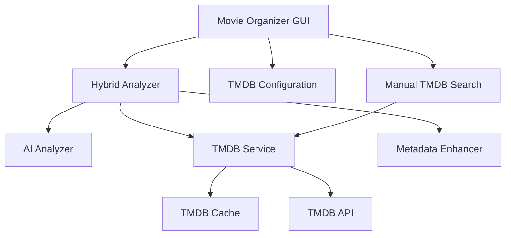

# Design Document - TMDB Integration

## Overview

Este design implementa a integração completa do TMDB (The Movie Database) ao Movie Organizer, criando um sistema híbrido que combina análise por IA com dados oficiais do TMDB para identificação precisa de filmes. O sistema manterá compatibilidade com o funcionamento atual enquanto adiciona capacidades avançadas de identificação e metadados.

## Architecture

### High-Level Architecture



### Integration Points

1. **MovieOrganizerGUI**: Ponto de entrada principal, gerencia configuração e interface
2. **HybridAnalyzer**: Orquestra análise AI + TMDB (já implementado)
3. **TMDBService**: Interface com API do TMDB (já implementado)
4. **Configuration System**: Gerencia chaves API e preferências
5. **Cache System**: Armazena resultados TMDB localmente
6. **Manual Search Interface**: Permite correções manuais

## Components and Interfaces

### 1. TMDB Configuration Manager

```python
class TMDBConfigManager:
    """Gerencia configurações específicas do TMDB"""
    
    def validate_api_credentials(api_key: str, bearer_token: str) -> bool
    def save_tmdb_config(config: TMDBConfig) -> None
    def load_tmdb_config() -> Optional[TMDBConfig]
    def is_tmdb_enabled() -> bool
```

**Responsabilidades:**
- Validar credenciais da API TMDB
- Salvar/carregar configurações TMDB
- Determinar se TMDB está habilitado

### 2. TMDB Cache System

```python
class TMDBCache:
    """Sistema de cache para resultados TMDB"""
    
    def get_cached_result(title: str, year: Optional[int]) -> Optional[TMDBMovieResult]
    def cache_result(title: str, year: Optional[int], result: TMDBMovieResult) -> None
    def is_cache_valid(cache_entry: CacheEntry) -> bool
    def clear_expired_cache() -> None
    def clear_all_cache() -> None
```

**Responsabilidades:**
- Armazenar resultados TMDB em cache local
- Verificar validade do cache (7 dias)
- Limpar cache expirado ou corrompido

### 3. Enhanced GUI Components

#### Settings Window Enhancement
```python
class TMDBSettingsPanel:
    """Painel de configurações TMDB na janela de settings"""
    
    def create_tmdb_section() -> tkinter.Frame
    def validate_and_save_credentials() -> bool
    def test_tmdb_connection() -> bool
    def show_connection_status() -> None
```

#### Movie Details Panel
```python
class MovieDetailsPanel:
    """Painel para mostrar detalhes TMDB dos filmes"""
    
    def show_tmdb_details(movie_result: TMDBMovieResult) -> None
    def show_poster_thumbnail(poster_path: str) -> None
    def show_movie_info(title: str, year: int, rating: float, overview: str) -> None
```

#### Manual Search Dialog
```python
class ManualSearchDialog:
    """Dialog para busca manual no TMDB"""
    
    def show_search_dialog(original_filename: str) -> Optional[TMDBMovieResult]
    def perform_search(query: str) -> List[TMDBMovieResult]
    def display_search_results(results: List[TMDBMovieResult]) -> None
    def handle_result_selection(result: TMDBMovieResult) -> None
```

### 4. Enhanced Analyzer Integration

```python
class AnalyzerManager:
    """Gerencia seleção entre AI-only e Hybrid analyzer"""
    
    def get_analyzer() -> Union[AIAnalyzer, HybridAnalyzer]
    def create_hybrid_analyzer() -> Optional[HybridAnalyzer]
    def fallback_to_ai_analyzer() -> AIAnalyzer
```

### 5. Metadata Enhancement System

```python
class MetadataEnhancer:
    """Enriquece metadados com informações TMDB"""
    
    def enhance_metadata(metadata: MovieMetadata, tmdb_result: TMDBMovieResult) -> EnhancedMovieMetadata
    def create_folder_name(tmdb_result: TMDBMovieResult) -> str
    def sanitize_filename(filename: str) -> str
```

### 6. Smart Folder Management System

```python
class SmartFolderManager:
    """Gerencia pastas de forma inteligente baseado no conteúdo"""
    
    def analyze_folder_content(folder_path: Path) -> FolderAnalysis
    def should_rename_existing_folder(folder_path: Path, movie_count: int) -> bool
    def rename_existing_folder(folder_path: Path, new_name: str) -> bool
    def create_individual_movie_folders(folder_path: Path, movies: List[MovieMetadata]) -> List[Path]
    def move_movie_to_folder(movie_file: Path, target_folder: Path) -> bool
```

## Data Models

### Enhanced Configuration

```python
@dataclass
class TMDBConfig:
    """Configuração específica do TMDB"""
    api_key: str
    bearer_token: str
    enabled: bool = True
    cache_duration_days: int = 7
    use_original_titles: bool = True
    language: str = "en-US"
    rate_limit_delay: float = 0.25
```

### Enhanced Movie Metadata

```python
@dataclass
class EnhancedMovieMetadata(MovieMetadata):
    """Metadados enriquecidos com informações TMDB"""
    tmdb_id: Optional[int] = None
    original_title: Optional[str] = None
    overview: Optional[str] = None
    poster_path: Optional[str] = None
    vote_average: Optional[float] = None
    popularity: Optional[float] = None
    genres: List[str] = field(default_factory=list)
    source: str = "ai"  # "ai", "tmdb", "hybrid", "manual"
```

### Cache Entry Model

```python
@dataclass
class TMDBCacheEntry:
    """Entrada do cache TMDB"""
    search_key: str  # title + year hash
    result: TMDBMovieResult
    cached_at: datetime
    expires_at: datetime
    
    def is_valid(self) -> bool
    def to_dict(self) -> Dict[str, Any]
    @classmethod
    def from_dict(cls, data: Dict[str, Any]) -> 'TMDBCacheEntry'
```

### Folder Analysis Model

```python
@dataclass
class FolderAnalysis:
    """Análise do conteúdo de uma pasta"""
    folder_path: Path
    movie_files: List[Path]
    movie_count: int
    has_single_movie: bool
    current_folder_name: str
    suggested_action: FolderAction
    
    @property
    def needs_folder_rename(self) -> bool:
        return self.has_single_movie and not self.is_already_movie_folder()
    
    def is_already_movie_folder(self) -> bool:
        """Verifica se a pasta já tem nome de filme (Título (Ano))"""
        import re
        pattern = r'^.+\s\(\d{4}\)$'
        return bool(re.match(pattern, self.current_folder_name))

@dataclass 
class FolderAction:
    """Ação recomendada para uma pasta"""
    action_type: str  # "rename_folder", "create_individual_folders", "no_action"
    target_name: Optional[str] = None
    individual_folders: List[str] = field(default_factory=list)
```

## Error Handling

### TMDB-Specific Error Handling

1. **API Connection Errors**
   - Timeout: Fallback para AI após 10 segundos
   - Rate Limit: Aguardar tempo necessário com backoff exponencial
   - Authentication: Mostrar erro claro e desabilitar TMDB

2. **Cache Errors**
   - Cache corrompido: Limpar cache e continuar
   - Erro de escrita: Continuar sem cache
   - Erro de leitura: Ignorar cache para essa consulta

3. **Search Errors**
   - Sem resultados: Fallback para AI
   - Resultados ambíguos: Usar critérios de ranking
   - Erro de parsing: Log erro e continuar

### Error Recovery Strategy

```python
class TMDBErrorHandler:
    """Tratamento de erros específicos do TMDB"""
    
    def handle_api_error(error: Exception) -> AnalyzerFallbackStrategy
    def handle_cache_error(error: Exception) -> CacheStrategy
    def handle_search_error(error: Exception) -> SearchFallbackStrategy
    def should_retry(error: Exception, attempt: int) -> bool
```

## Testing Strategy

### Unit Tests

1. **TMDBService Tests**
   - Teste de conexão API
   - Teste de busca com diferentes parâmetros
   - Teste de rate limiting
   - Teste de parsing de resultados

2. **HybridAnalyzer Tests**
   - Teste de integração AI + TMDB
   - Teste de fallback para AI
   - Teste de validação de matches
   - Teste com diferentes tipos de arquivos

3. **Cache System Tests**
   - Teste de armazenamento e recuperação
   - Teste de expiração de cache
   - Teste de limpeza de cache
   - Teste de cache corrompido

4. **Configuration Tests**
   - Teste de validação de credenciais
   - Teste de salvamento/carregamento
   - Teste de configurações inválidas

### Integration Tests

1. **End-to-End TMDB Flow**
   - Teste completo: arquivo → análise → TMDB → organização
   - Teste com diferentes tipos de filmes
   - Teste com filmes não encontrados no TMDB
   - Teste de performance com muitos arquivos

2. **GUI Integration Tests**
   - Teste de configuração via interface
   - Teste de busca manual
   - Teste de exibição de detalhes
   - Teste de fallback quando TMDB indisponível

3. **Error Scenario Tests**
   - Teste sem conexão internet
   - Teste com API TMDB indisponível
   - Teste com credenciais inválidas
   - Teste de recuperação de erros

### Performance Tests

1. **Cache Performance**
   - Teste de velocidade com cache vs sem cache
   - Teste de uso de memória do cache
   - Teste de performance com cache grande

2. **API Rate Limiting**
   - Teste de resposta a rate limits
   - Teste de throughput com rate limiting
   - Teste de backoff exponencial

## Smart Folder Management Logic

### Folder Analysis Algorithm

1. **Scan Folder Content**
   ```
   FOR each folder being processed:
     - Count video files in folder
     - Analyze current folder name
     - Determine if folder already follows movie naming convention
   ```

2. **Decision Logic**
   ```
   IF folder contains exactly 1 movie file:
     IF current folder name is NOT already a movie name format:
       → RENAME existing folder to movie name
     ELSE:
       → KEEP existing folder name
   
   ELSE IF folder contains multiple movie files:
     FOR each movie file:
       → CREATE individual movie folder
       → MOVE movie file to its own folder
   ```

3. **Folder Naming Strategy**
   - Single movie: Rename existing folder to "Movie Title (Year)"
   - Multiple movies: Create folders "Movie1 Title (Year)", "Movie2 Title (Year)", etc.
   - Preserve existing movie-named folders if they already follow the convention

### Example Scenarios

**Scenario 1: Single Movie in Generic Folder**
```
Before: /Movies/Random Folder Name/movie.mkv
After:  /Movies/The Matrix (1999)/The Matrix (1999).mkv
```

**Scenario 2: Single Movie in Already Named Folder**
```
Before: /Movies/The Matrix (1999)/matrix.1999.mkv
After:  /Movies/The Matrix (1999)/The Matrix (1999).mkv
```

**Scenario 3: Multiple Movies in One Folder**
```
Before: /Movies/Action Movies/matrix.mkv, terminator.mkv
After:  /Movies/Action Movies/The Matrix (1999)/The Matrix (1999).mkv
        /Movies/Action Movies/Terminator (1984)/Terminator (1984).mkv
```

## Implementation Phases

### Phase 1: Core Integration
- Integrar HybridAnalyzer ao MovieOrganizerGUI
- Implementar TMDBConfigManager
- Adicionar configurações TMDB à interface

### Phase 2: Smart Folder Management
- Implementar SmartFolderManager
- Implementar FolderAnalysis system
- Integrar lógica de renomeação/criação de pastas

### Phase 3: Cache System
- Implementar TMDBCache
- Integrar cache ao TMDBService
- Adicionar limpeza automática de cache

### Phase 4: Enhanced GUI
- Implementar MovieDetailsPanel
- Adicionar informações TMDB à interface principal
- Implementar indicadores visuais de fonte (AI vs TMDB)
- Mostrar preview das ações de pasta (rename vs create)

### Phase 5: Manual Search
- Implementar ManualSearchDialog
- Adicionar botões de busca manual
- Implementar salvamento de correções manuais

### Phase 6: Polish & Optimization
- Otimizar performance
- Melhorar tratamento de erros
- Adicionar configurações avançadas
- Implementar testes abrangentes

## Security Considerations

1. **API Key Storage**
   - Armazenar chaves de forma segura (não em plain text)
   - Usar encryption local para chaves sensíveis
   - Não logar chaves em logs

2. **Network Security**
   - Usar HTTPS para todas as chamadas TMDB
   - Validar certificados SSL
   - Implementar timeout apropriado

3. **Cache Security**
   - Validar integridade do cache
   - Limitar tamanho do cache
   - Limpar cache em caso de suspeita de corrupção

## Performance Considerations

1. **API Efficiency**
   - Implementar rate limiting adequado
   - Usar connection pooling
   - Minimizar chamadas desnecessárias

2. **Cache Strategy**
   - Cache inteligente baseado em popularidade
   - Limpeza automática de cache antigo
   - Compressão de dados de cache se necessário

3. **UI Responsiveness**
   - Operações TMDB em threads separadas
   - Loading indicators para operações longas
   - Cancelamento de operações em andamento