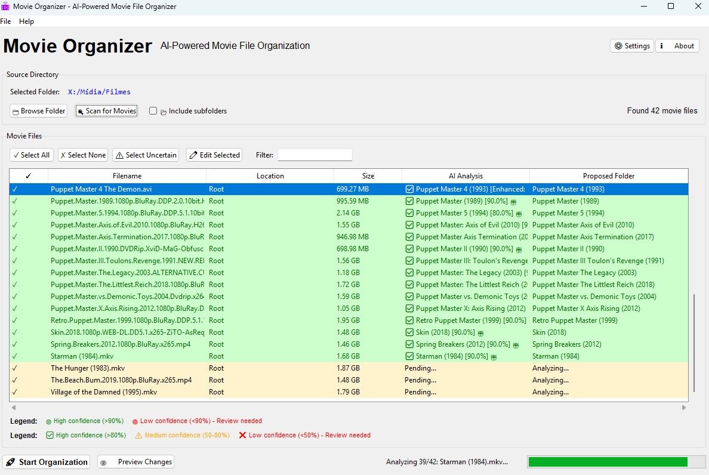

# 🎬 Movie Organizer

**AI-Powered Movie File Organizer with TMDB Integration**

*Version: 0.1*  
*Author: Pablo Murad (runawaydevil)*  
*Repository: https://github.com/runawaydevil/organizer-movies.git*

[](https://github.com/runawaydevil/organizer-movies)
[](https://python.org)
[](LICENSE)
[](#installation)
[](https://openai.com)
[](https://www.themoviedb.org)
[](#usage)
[](https://github.com/runawaydevil/organizer-movies)

Organize your movie collection automatically using AI and The Movie Database (TMDB) API. This tool analyzes movie filenames, identifies movies using AI and TMDB, creates properly named folders, and generates comprehensive PDF reports.



*Movie Organizer v0.1 - Clean, intuitive interface for organizing your movie collection*

## ✨ Features

### 🤖 **Intelligent Analysis**
- **AI-Powered**: Uses OpenAI GPT models to analyze movie filenames
- **TMDB Integration**: Enhances accuracy with The Movie Database API
- **Hybrid Mode**: Combines AI + TMDB for best results
- **Smart Fallback**: Works with AI-only if TMDB is unavailable

### 📁 **Smart Organization**
- **Automatic Folder Creation**: Creates folders in format "Movie Title (Year)"
- **Intelligent Folder Management**: 
  - Single movie: Renames existing folder
  - Multiple movies: Creates individual folders for each
- **Media Server Compatible**: Works with Plex, Jellyfin, Emby, Kodi
- **Network Support**: Handles network drives and mapped drives

### 🎯 **Advanced Features**
- **Manual Search**: Search TMDB manually for difficult movies
- **Metadata Editing**: Edit movie information before organizing
- **PDF Reports**: Automatic generation of organized movies report
- **Duplicate Prevention**: Tracks organized movies to avoid reprocessing
- **Cache System**: Caches TMDB results for better performance

### 🖥️ **User Interface**
- **Modern GUI**: Clean, intuitive interface built with tkinter
- **Real-time Progress**: Live progress updates during processing
- **Confidence Indicators**: Shows analysis confidence levels
- **Network Detection**: Automatically detects and handles network paths
- **Settings Panel**: Easy configuration of all options

## 🚀 Quick Start

### Prerequisites

- **Python 3.8+** (Required)
- **OpenAI API Key** (Required - for AI movie identification)
- **TMDB API Key & Bearer Token** (Optional but recommended - for enhanced accuracy)

### Installation

1. **Clone the repository:**
   ```bash
   git clone https://github.com/runawaydevil/organizer-movies.git
   cd organizer-movies
   ```

2. **Install dependencies:**
   ```bash
   pip install -r requirements.txt
   ```

3. **Run the application:**
   
   **Windows/Linux (GUI):**
   ```bash
   python main.py
   ```
   
   **Linux (CLI):**
   ```bash
   python services/cli_organizer.py
   ```

### First Time Setup

1. **Get API Keys:**
   - **OpenAI**: Visit [OpenAI API](https://platform.openai.com/api-keys) (Required)
   - **TMDB**: Visit [TMDB API](https://www.themoviedb.org/settings/api) (Optional)

2. **Configure in GUI:**
   - Open Settings (File → Settings or Ctrl+,)
   - Enter your OpenAI API key (required)
   - Optionally enter TMDB credentials for better accuracy
   - Keys are encrypted and stored securely locally

3. **Start Organizing:**
   - Select your movie folder
   - Review AI-identified movies
   - Click "Process Files" to organize

## � Ussage

### GUI Mode
```bash
python main.py
```

### CLI Mode
```bash
python services/cli_organizer.py
```

### Basic Workflow
1. **Configure API Keys** - Set up OpenAI (required) and TMDB (optional) APIs
2. **Select Movie Folder** - Choose folder containing your movie files
3. **AI Analysis** - Let AI identify your movies automatically
4. **Review & Organize** - Check results and organize with one click
5. **PDF Report** - Get automatic reports of organized movies

## 📚 Documentation

- **[API Setup Guide](docs/API_SETUP.md)** - Configure OpenAI and TMDB APIs
- **[CLI Usage Guide](docs/CLI_USAGE.md)** - Command line interface
- **[Troubleshooting](docs/TROUBLESHOOTING.md)** - Common issues and solutions
- **[Developer Setup](docs/DEVELOPER_SETUP.md)** - Development environment
- **[Contributing](docs/CONTRIBUTING.md)** - How to contribute
- **[Changelog](docs/CHANGELOG.md)** - Version history

## 🏗️ Project Structure

```
movie-organizer/
├── main.py                    # GUI entry point
├── cli.py                     # CLI entry point  
├── version.py                 # Version management
├── models/                    # Data models
├── services/                  # Core services
├── docs/                      # Documentation
├── scripts/                   # Build and utility scripts
├── Images/                    # Screenshots and assets
└── README.md                  # This file
```

## 🔧 Build & Release

### For Users
- Download latest release from [GitHub Releases](https://github.com/runawaydevil/organizer-movies/releases)
- Windows: Use installer or portable version
- Linux/macOS: Run from source

### For Developers
```bash
# Build release package
python scripts/build_release.py

# Create Git tag
python scripts/create_git_tag.py
```

See [Release Instructions](docs/RELEASE_INSTRUCTIONS.md) for details.

## 🔒 Security & Privacy

- **🔐 Encrypted API Keys**: AES-256 encryption for secure local storage
- **🏠 Local Processing**: All analysis done on your machine
- **🚫 No Telemetry**: Zero data collection or tracking
- **🔒 Secure Communication**: Only movie titles sent to APIs

## 🤝 Contributing

We welcome contributions! Please see our [Contributing Guide](docs/CONTRIBUTING.md) for details.

## 🐛 Need Help?

- 📖 **Documentation**: Check the [docs/](docs/) folder
- 🐛 **Issues**: [GitHub Issues](https://github.com/runawaydevil/organizer-movies/issues)
- 💬 **Discussions**: [GitHub Discussions](https://github.com/runawaydevil/organizer-movies/discussions)
- 🔧 **Troubleshooting**: [Common Issues Guide](docs/TROUBLESHOOTING.md)

## 📄 License

**Free & Open Source Software**

This project is **completely free** and licensed under the MIT License. You can:

✅ **Use** it for personal or commercial purposes  
✅ **Copy** and distribute it freely  
✅ **Modify** and create derivative works  
✅ **Sell** software that includes this code  

**Only requirement**: Give credit to **Pablo Murad (runawaydevil)** as the original author.

See the [LICENSE](LICENSE) file for complete details.

## 🙏 Acknowledgments

- **OpenAI** for GPT API and AI capabilities
- **The Movie Database (TMDB)** for comprehensive movie metadata
- **ReportLab** for PDF generation capabilities
- **Cryptography** library for secure API key storage
- All contributors and users who help improve this project

## 📞 Support

- **Issues**: [GitHub Issues](https://github.com/runawaydevil/organizer-movies/issues)
- **Discussions**: [GitHub Discussions](https://github.com/runawaydevil/organizer-movies/discussions)
- **Repository**: https://github.com/runawaydevil/organizer-movies.git

---

**Movie Organizer v0.1**  
**Made with ❤️ by Pablo Murad (runawaydevil)**  
*Organize your movie collection like a pro! 🎬*